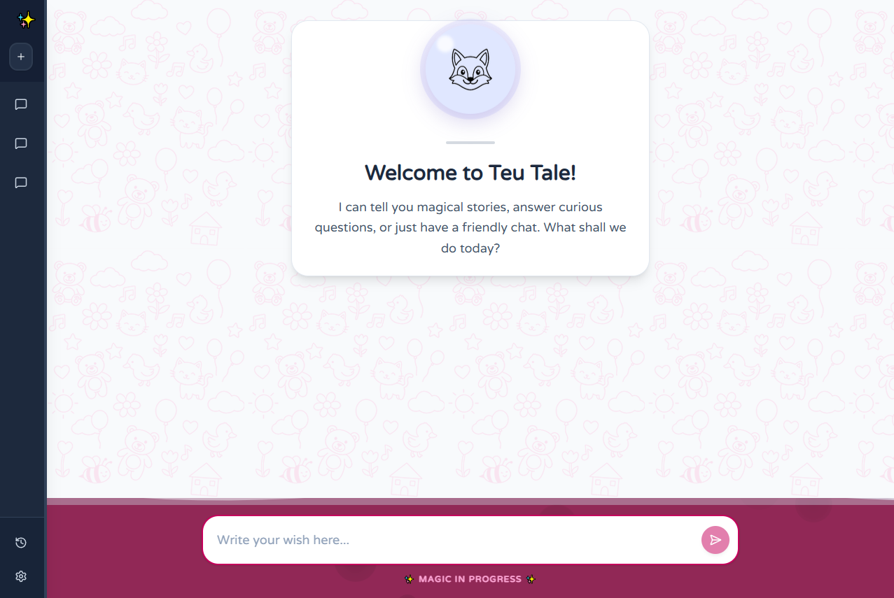

# Chat SPA

The **Chat SPA** (Single Page Application) is the frontend interface for the World Premiere bedtime story generator. It provides a modern, responsive chat interface for users to interact with the AI story generation backend.

## 🚀 Tech Stack

- **Framework**: [Next.js 14](https://nextjs.org/) (App Router)
- **Language**: [TypeScript](https://www.typescriptlang.org/)
- **Styling**: [Tailwind CSS](https://tailwindcss.com/)
- **Icons**: [Lucide React](https://lucide.dev/)
- **Testing**: [Jest](https://jestjs.io/) & [React Testing Library](https://testing-library.com/)
- **Containerization**: [Docker](https://www.docker.com/)

## 📋 Prerequisites

- Node.js 18+
- npm or yarn

## 🛠️ Installation

1. Navigate to the project directory:
   ```bash
   cd chat-spa
   ```

2. Install dependencies:
   ```bash
   npm install
   ```

## 🏃‍♂️ Running Locally

To start the development server:

```bash
npm run dev
```

Open [http://localhost:3000](http://localhost:3000) with your browser to see the result.

## 🐳 Running with Docker

You can build and run the application using Docker:

1. **Build the image**:
   ```bash
   docker build -t chat-spa .
   ```

2. **Run the container**:
   ```bash
   docker run -p 3000:3000 chat-spa
   ```

Alternatively, use Docker Compose from the root of the repository to run the full stack.

## 🧪 Testing

This project uses Jest and React Testing Library for unit testing.

- **Run tests**:
  ```bash
  npm test
  ```

- **Run tests in watch mode**:
  ```bash
  npm run test:watch
  ```

## 📂 Project Structure

The project follows a **Feature-Based Architecture** combined with **Atomic Design** principles.

```
chat-spa/
├── app/                 # Next.js App Router pages and layouts
│   ├── globals.css      # Global styles
│   ├── layout.tsx       # Root layout
│   └── page.tsx         # Main chat page
├── components/          # Shared UI components (Atomic Design)
│   ├── atoms/           # Basic building blocks (Button, Avatar, etc.)
│   ├── molecules/       # Groups of atoms
│   ├── organisms/       # Complex UI sections
│   └── templates/       # Page layouts
├── features/            # Feature-based modules
│   └── chat/            # Chat feature module
│       ├── components/  # Chat-specific components
│       └── types/       # Chat-specific TypeScript interfaces
├── lib/                 # Utility functions
├── public/              # Static assets
├── Dockerfile           # Docker configuration
├── jest.config.js       # Jest configuration
├── next.config.js       # Next.js configuration
├── tailwind.config.js   # Tailwind CSS configuration
└── tsconfig.json        # TypeScript configuration
```

## 🔧 Configuration

- **Environment Variables**:
  - `NEXT_PUBLIC_API_URL`: URL of the backend API (default: `http://localhost:8080`)
   - `NEXT_PUBLIC_USE_MOCK`: when set to `true`, the frontend will use a local mock chat service instead of calling the backend (default: `false`).

### API Integration

The frontend can call the backend chat endpoint at `/api/v1/chat`. By default the app will call the relative path (same origin). To call a different backend, set `NEXT_PUBLIC_API_URL`.

Example `.env.local`:

```
NEXT_PUBLIC_API_URL=http://localhost:8080
NEXT_PUBLIC_USE_MOCK=false
```

## 🤝 Contributing

1. Fork the repository
2. Create your feature branch (`git checkout -b feature/amazing-feature`)
3. Commit your changes (`git commit -m 'feat: add amazing feature'`)
4. Push to the branch (`git push origin feature/amazing-feature`)
5. Open a Pull Request

## 📸 Screenshots


